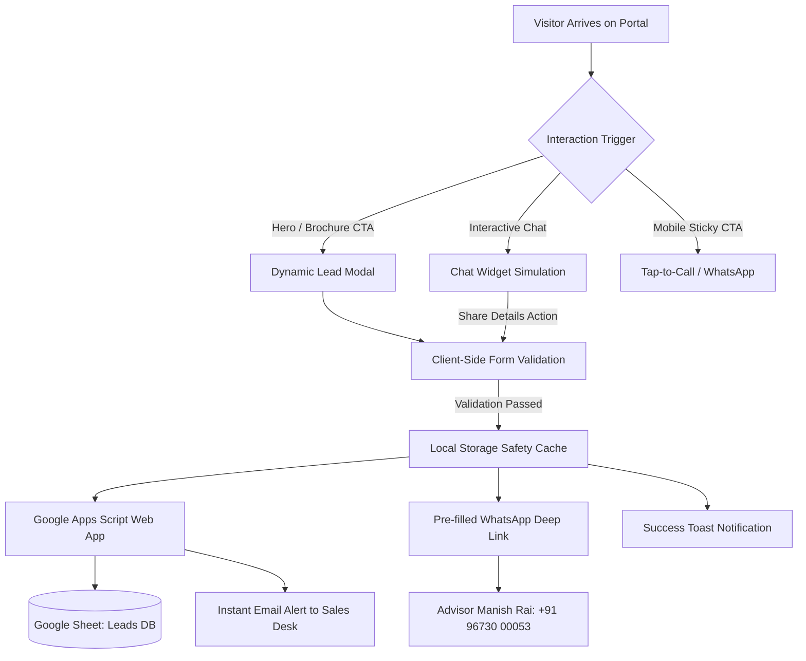

# Godrej Ivara — Central Kharadi, Pune (Official Project Portal)

[](https://24krealtorshinjewadi-blip.github.io/Godrej-Ivara---2-3-4-BHK-Apartments-in-Central-Kharadi-Pune/)
[](https://maharera.mahaonline.gov.in/)
[](docs/HANDOVER_GUIDE.md#lead-capture-pipeline)
[](docs/MASTER_TEST_REPORT.md)

---

## 🌟 Executive Overview

Welcome to the official web repository for **Godrej Ivara**, an ultra-premium 13-acre township development situated in Central Kharadi, Pune, developed by **Godrej Properties**. 

This repository houses the complete, production-grade source code, asset pipeline, client handover manuals, defect resolution audits, comprehensive QA test reports, and mobile responsiveness matrices prepared specifically for handover to **24k Realtors Hinjewadi**.

### Key Project Specifications
| Metric | Specification |
| :--- | :--- |
| **Developer** | Godrej Properties |
| **Project Name** | Godrej Ivara |
| **Location** | Upper Kharadi Main Rd, Wagholi, Haveli, Pune, MH 412207 |
| **Land Parcel** | 13 Acres (11 High-Rise Towers) |
| **Elevation** | G + 5P + 30 Floors |
| **Typologies** | 2, 3 & 4 BHK Luxury Residences |
| **Pricing** | ₹ 1.15 Cr to ₹ 2.79 Cr (Closing Price) |
| **EOI Token** | From ₹ 2 Lakhs (Priority Selection) |
| **Possession** | August 2032 |
| **MahaRERA Registration** | **PR1260002502426** |
| **Primary Sales Advisor** | Manish Rai (+91 96730 00053) |

---

## 🚀 Live Portal Access

The application is configured for zero-dependency static web deployment via GitHub Pages and modern CDN networks:

- **Official Live Portal URL**:  
  👉 **`https://24krealtorshinjewadi-blip.github.io/Godrej-Ivara---2-3-4-BHK-Apartments-in-Central-Kharadi-Pune/`**
- **Deployment Guide**: [docs/LIVE_PORTAL_GUIDE.md](docs/LIVE_PORTAL_GUIDE.md)

---

## 🛠️ Technology Architecture

Built with a performance-first, vanilla modern stack ensuring near-instant load times, zero third-party framework bundle overhead, and maximum cross-platform compatibility:

- **Markup & Semantics**: Semantic HTML5 with complete Schema/OpenGraph/Twitter microdata.
- **Styling & Design System**: Responsive Vanilla CSS3 using custom properties, glassmorphism, responsive clamps, and custom typography (`Playfair Display` + `Inter`).
- **Client Logic & State**: Modular Vanilla JavaScript (ES6+), handling dynamic lead modals, country code selection, form validation, and interactive chat simulation.
- **Lead Capture Pipeline**: Dual-dispatch architecture:
  1. Asynchronous Google Apps Script REST endpoint saving to centralized **Google Sheets** + instant **Email Alert**.
  2. Pre-formatted **WhatsApp Business deep link** redirect for immediate sales engagement.
  3. Client-side **LocalStorage safety cache** with JSON export capability to ensure zero lead loss.



---

## 📂 Project Structure

```text
├── .github/
│   └── workflows/
│       └── deploy.yml              # Automated GitHub Pages CI/CD workflow
├── assets/
│   ├── favicon.svg                 # Scalable gold emblem SVG favicon
│   └── pricing-offers.jpg          # High-resolution pricing & spot booking banner
├── css/
│   └── style.css                   # Enterprise stylesheet (Design tokens, media queries)
├── docs/
│   ├── HANDOVER_GUIDE.md           # Master handover & developer onboarding manual
│   ├── ISSUE_REPORT.md             # Defect audit, resolved bugs & risk analysis
│   ├── MASTER_TEST_REPORT.md       # Comprehensive 50+ point QA test execution report
│   ├── MOBILE_TESTING_MATRIX.md    # Multi-device & viewport responsive audit matrix
│   └── LIVE_PORTAL_GUIDE.md        # Deployment, custom domains & DNS guide
├── google-apps-script/
│   ├── Code.gs                     # Google Apps Script Web App source code
│   └── SETUP.txt                   # 5-minute setup SOP for Google Sheets + Email alerts
├── js/
│   ├── config.js                   # Client configurable settings (URLs, phone, project name)
│   └── main.js                     # Core application logic & UI controllers
├── .gitignore                      # Git exclusion rules
├── index.html                      # Production landing page
└── README.md                       # Repository master documentation
```

---

## ⚡ Quick Start & Local Development

No Node.js compilation or heavy build pipeline required!

1. **Clone the repository**:
   ```bash
   git clone https://github.com/24krealtorshinjewadi-blip/Godrej-Ivara---2-3-4-BHK-Apartments-in-Central-Kharadi-Pune.git
   cd Godrej-Ivara---2-3-4-BHK-Apartments-in-Central-Kharadi-Pune
   ```

2. **Launch locally**:
   - Using VS Code: Right-click `index.html` → **Open with Live Server**.
   - Using Python:
     ```bash
     python -m http.server 8080
     ```
   - Using Node / npx:
     ```bash
     npx serve .
     ```
   - Open browser at: `http://localhost:8080`

3. **Configure Lead Destination**:
   Edit `js/config.js` to plug in your live Google Apps Script URL:
   ```javascript
   window.LEAD_CONFIG = {
     googleScriptUrl: "https://script.google.com/macros/s/YOUR_SCRIPT_ID/exec",
     openWhatsAppOnSubmit: true,
     projectName: "Godrej Ivara Kharadi"
   };
   ```

---

## 📑 Handover Documentation Directory

For complete corporate handover documentation, refer to the detailed reports below:

1. 📘 **[Master Handover Guide](docs/HANDOVER_GUIDE.md)**: Step-by-step developer onboarding, DNS/Hosting setup, Google Sheets integration SOP, credentials checklist, and operational runbooks.
2. 🐞 **[Issue & Defect Report](docs/ISSUE_REPORT.md)**: Complete audit of resolved bugs, technical debt cleanup, performance optimizations, and future enhancement roadmap.
3. 🧪 **[Master QA Test Report](docs/MASTER_TEST_REPORT.md)**: Full verification suite covering functional tests, validation rules, cross-browser compatibility, and lead delivery failovers.
4. 📱 **[Mobile Testing Matrix](docs/MOBILE_TESTING_MATRIX.md)**: Comprehensive responsive matrix across 10+ iOS and Android devices, viewports, touch targets, and sticky bars.
5. 🌐 **[Live Portal & Deployment Guide](docs/LIVE_PORTAL_GUIDE.md)**: GitHub Pages activation, Custom Domain / CNAME configuration, SSL setup, and production verification.

---

## 📞 Support & Handover Contacts

- **Authorized Marketing Partner**: 24k Realtors Hinjewadi
- **Primary Sales Advisor**: Manish Rai (`+91 96730 00053`)
- **Official WhatsApp**: [wa.me/919673000053](https://wa.me/919673000053)
- **MahaRERA Portal**: [maharera.mahaonline.gov.in](https://maharera.mahaonline.gov.in) (PR1260002502426)
