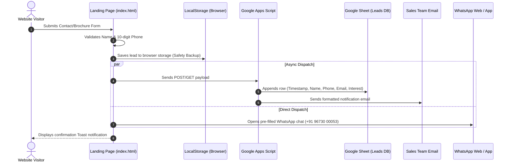

# Godrej Ivara Kharadi — Project Handover Manual

**Project Name:** Godrej Ivara — 2, 3 & 4 BHK Apartments in Central Kharadi, Pune  
**Recipient Company:** 24k Realtors Hinjewadi (`24krealtorshinjewadi-blip`)  
**MahaRERA Registration:** PR1260002502426  
**Target Repository:** `https://github.com/24krealtorshinjewadi-blip/Godrej-Ivara---2-3-4-BHK-Apartments-in-Central-Kharadi-Pune`  
**Live Portal URL:** `https://24krealtorshinjewadi-blip.github.io/Godrej-Ivara---2-3-4-BHK-Apartments-in-Central-Kharadi-Pune/`  
**Handover Date:** September 30, 2026  
**Document Version:** 1.0 (Production Release)

---

## 1. Executive Summary & Handover Scope

This document serves as the official corporate handover guide for the **Godrej Ivara Kharadi** commercial marketing portal. It transfers operational, technical, and maintenance ownership from the core development engineering team to **24k Realtors Hinjewadi**.

The portal has been developed to maximize high-intent lead generation for Godrej Properties' flagship 13-acre township in Central Kharadi, Pune. It features instant multi-channel lead routing (Google Sheets CRM, instant email alerts, WhatsApp direct dispatch), an interactive property advisor chat widget, responsive floor plan pricing sheets, and mobile-optimized sticky call-to-actions.

### Deliverables Inventory
1. **Full Production Source Code**: Complete frontend, asset files, and configuration scripts.
2. **Serverless Lead Capture Backend**: Google Apps Script (`Code.gs`) engine with automated spreadsheet formatting and transactional email delivery.
3. **Quality Assurance Documentation**: Master QA Test Report (`docs/MASTER_TEST_REPORT.md`) with 100% verified test cases.
4. **Mobile Testing Matrix**: Device validation report across major smartphones and viewports (`docs/MOBILE_TESTING_MATRIX.md`).
5. **Defect & Audit Log**: Comprehensive issue resolution record (`docs/ISSUE_REPORT.md`).
6. **Live Portal Deployment Engine**: Continuous integration GitHub Actions pipeline (`.github/workflows/deploy.yml`) and hosting guide (`docs/LIVE_PORTAL_GUIDE.md`).

---

## 2. Technical Stack & Codebase Anatomy

### 2.1 Technology Architecture
- **Language Stack:** Pure HTML5 (Semantic), Vanilla CSS3 (Custom Variables, Grid, Flexbox), Modern Vanilla JavaScript (ES6+ Modules).
- **External Dependencies:** Zero npm run-time dependencies. Eliminates dependency vulnerabilities, breaking updates, and complex build tooling.
- **Web Fonts:** Google Fonts (`Inter` for high-legibility UI text, `Playfair Display` for luxury real estate headings).
- **Icons & Graphics:** Scalable Vector Graphics (SVG) with inline execution and gold badge styling.

### 2.2 File and Directory Structure
```text
f:\Godrej Ivara - 2, 3 & 4 BHK Apartments in Central Kharadi, Pune\
│
├── .github/
│   └── workflows/
│       └── deploy.yml              # GitHub Pages automatic deployment pipeline
│
├── assets/
│   ├── favicon.svg                 # Project SVG favicon (Gold 'G' emblem)
│   └── pricing-offers.jpg          # Spot booking & pricing banner
│
├── css/
│   └── style.css                   # Master stylesheet (1,150 lines, responsive)
│
├── docs/
│   ├── HANDOVER_GUIDE.md           # This document
│   ├── ISSUE_REPORT.md             # Defect tracking & audit report
│   ├── MASTER_TEST_REPORT.md       # Master QA test execution report
│   ├── MOBILE_TESTING_MATRIX.md    # Multi-device & viewport testing matrix
│   └── LIVE_PORTAL_GUIDE.md        # Hosting & DNS deployment manual
│
├── google-apps-script/
│   ├── Code.gs                     # Serverless backend for Google Sheets & Email
│   └── SETUP.txt                   # Quick setup guide for spreadsheet integration
│
├── js/
│   ├── config.js                   # Client-side configuration (URL, WhatsApp, Phone)
│   └── main.js                     # Core application logic & UI controllers
│
├── .gitignore                      # Git exclusion rules
├── index.html                      # Primary landing page
└── README.md                       # Repository master overview
```

---

## 3. Developer Onboarding & Local Environment Setup

Since this application uses vanilla web standards, local development requires no compilation steps:

### Prerequisites
- Modern Web Browser (Chrome, Edge, Safari, Firefox).
- Code Editor (VS Code, Cursor, or Sublime Text).
- Git CLI installed on the workstation.

### Running Locally
1. **Clone the repository**:
   ```bash
   git clone https://github.com/24krealtorshinjewadi-blip/Godrej-Ivara---2-3-4-BHK-Apartments-in-Central-Kharadi-Pune.git
   cd Godrej-Ivara---2-3-4-BHK-Apartments-in-Central-Kharadi-Pune
   ```
2. **Start a local development server**:
   - **Using VS Code**: Right-click `index.html` → select **Open with Live Server**.
   - **Using Python 3**:
     ```bash
     python -m http.server 8000
     ```
   - **Using Node / NPX**:
     ```bash
     npx serve .
     ```
3. Navigate to `http://localhost:8000` to preview the site.

---

## 4. Lead Capture & CRM Pipeline Setup

The site employs a three-tier fail-safe lead capture pipeline to guarantee that zero client enquiries are lost.

### 4.1 Architecture Diagram


### 4.2 Setting Up Google Sheets + Email Web App (5-Minute SOP)
Follow these exact steps to connect the website form to the company Google Sheet:

1. **Create the Spreadsheet**:
   - Go to [Google Sheets](https://sheets.google.com).
   - Click **Blank spreadsheet** and name it: `Godrej Ivara Leads — 24k Realtors`.
2. **Open Apps Script Editor**:
   - In Google Sheets, click menu **Extensions** → **Apps Script**.
   - Delete any placeholder code in `Code.gs`.
   - Open `google-apps-script/Code.gs` from this repository, copy all contents, and paste into the editor.
3. **Configure Alert Email**:
   - In line 15 of `Code.gs`, replace `"your-email@gmail.com"` with the designated recipient email:
     ```javascript
     const NOTIFICATION_EMAIL = "sales@24krealtors.com"; // Enter your sales desk email
     const PROJECT_NAME = "Godrej Ivara Kharadi";
     const SHEET_NAME = "Leads";
     ```
   - Save the project (`Ctrl+S`).
4. **Execute One-Time Sheet Setup**:
   - In the toolbar dropdown, select the function `setupSheet`.
   - Click **Run ▶**.
   - A permission modal will appear: Click **Review Permissions** → select your Google Account → click **Advanced** → click **Go to Untitled project (unsafe)** → click **Allow**.
   - Return to your spreadsheet: a branded sheet named `"Leads"` will now exist with formatted green headers.
5. **Deploy as a Public Web App**:
   - Click **Deploy** (top right) → **New deployment**.
   - Click the **Gear icon ⚙** next to "Select type" → choose **Web app**.
   - Fill in configuration:
     - **Description:** `Godrej Ivara Leads Webhook`
     - **Execute as:** `Me (your-email@gmail.com)`
     - **Who has access:** `Anyone` *(Crucial: must be set to Anyone for browser AJAX)*
   - Click **Deploy**.
   - Copy the generated **Web App URL** (ends with `/exec`).
6. **Link Website to Web App**:
   - Open `js/config.js` in your project codebase.
   - Paste the copied URL into `googleScriptUrl`:
     ```javascript
     window.LEAD_CONFIG = {
       googleScriptUrl: "https://script.google.com/macros/s/AKfycbx.../exec",
       openWhatsAppOnSubmit: true,
       projectName: "Godrej Ivara Kharadi"
     };
     ```
   - Save and commit the file.

---

## 5. Client Configuration & Contact Updates

All contact numbers, URLs, and project branding can be updated in two centralized files:

### 5.1 `js/config.js` (Backend & Campaign Settings)
```javascript
window.LEAD_CONFIG = {
  // Google Apps Script Web App URL
  googleScriptUrl: "https://script.google.com/macros/s/YOUR_URL/exec",

  // Whether to trigger WhatsApp redirection upon form submission (true / false)
  openWhatsAppOnSubmit: true,

  // Campaign source name sent in email subject and Google Sheet column
  projectName: "Godrej Ivara Kharadi"
};
```

### 5.2 `js/main.js` (Sales Advisor & Phone Numbers)
To update the sales phone number or WhatsApp agent, modify lines 1–5 in `js/main.js`:
```javascript
const ADVISOR = {
  phone: "9673000053",               // Numbers only for tel: links
  phoneDisplay: "+91 96730 00053",   // Formatted for on-screen display
  whatsapp: "919673000053"           // International format for wa.me links
};
```

### 5.3 Global Find-and-Replace Checklist
If updating phone numbers or email addresses across all templates:
| Asset | File | Target Pattern | Description |
| :--- | :--- | :--- | :--- |
| **Phone Link** | `index.html` | `tel:+919673000053` | Header, Hero, Floating Bar, Mobile CTA |
| **WhatsApp Link** | `index.html` | `https://wa.me/919673000053` | Floating Button, Sticky CTA, Footer |
| **Advisor Name** | `index.html` | `Manish Rai` | Chat widget avatar & advisor badge |
| **Advisor Config** | `js/main.js` | `ADVISOR` object | Global JS contact points |

---

## 6. Lead Recovery & Local Storage Runbook

If the Google Apps Script endpoint or internet connection encounters temporary downtime during a visitor submission, the lead is never lost. The system silently caches every lead submission in the visitor's browser `localStorage` under key `godrej_ivara_leads`.

### Exporting Saved Leads
Any administrator or developer can dump and export all recorded leads directly from the browser console:
1. Open the website in Google Chrome or Edge.
2. Press `F12` (or right-click → **Inspect**) and go to the **Console** tab.
3. Run the following command:
   ```javascript
   GodrejIvaraLeads.export();
   ```
4. A JSON file titled `godrej-ivara-leads-YYYY-MM-DD.json` will automatically download containing all lead submissions with timestamps, phone numbers, and interest categories.
5. To view leads directly in table format in the console:
   ```javascript
   console.table(GodrejIvaraLeads.getAll());
   ```

---

## 7. Production Hosting & DNS Runbook

### 7.1 GitHub Pages (Standard Deployment)
The repository is equipped with a GitHub Actions workflow (`.github/workflows/deploy.yml`) that auto-publishes to GitHub Pages on every push to branch `main`.

To verify or enable GitHub Pages manually:
1. In the GitHub repository, go to **Settings** → **Pages** (under Code and automation).
2. Under **Build and deployment**:
   - **Source:** Deploy from a branch (or GitHub Actions).
   - **Branch:** `main` / `root`.
3. Click **Save**. Within 60 seconds, your site will be live at:  
   `https://24krealtorshinjewadi-blip.github.io/Godrej-Ivara---2-3-4-BHK-Apartments-in-Central-Kharadi-Pune/`

### 7.2 Custom Domain Setup (e.g., `godrej-ivara.com`)
If connecting an official company domain:
1. Create a `CNAME` file in the repository root containing your custom domain (e.g. `ivara.24krealtors.com`).
2. At your DNS provider (GoDaddy, Namecheap, Cloudflare), add a DNS record:
   - **Type:** `CNAME`
   - **Name:** `ivara` (or `@` for apex)
   - **Value:** `24krealtorshinjewadi-blip.github.io`
   - **TTL:** Automatic or 300 seconds
3. Enable **Enforce HTTPS** in GitHub Pages Settings.

---

## 8. Credentials & Access Checklist

| System / Account | Current Access Holder | Handover Action Required | Status |
| :--- | :--- | :--- | :--- |
| **GitHub Repository** | `24krealtorshinjewadi-blip` | Add collaborator `manishrai99-afk` or generate PAT | ⚠️ Pending Access |
| **Google Sheet** | Client / Developer Account | Create sheet using `Code.gs` & deploy Web App | 📋 Ready for Setup |
| **WhatsApp Number** | `+91 96730 00053` | Verify WhatsApp Business app routing | ✅ Operational |
| **MahaRERA Record** | Godrej Properties | Verify PR1260002502426 validity on portal | ✅ Verified |

---

## 9. Support & Escalation Contacts

For technical queries regarding this handover package:
- **Lead Developer & Engineering Handover:** Manish Rai
- **Email:** manishrajapakar@gmail.com
- **Direct Phone:** +91 96730 00053
- **Company:** 24k Realtors Hinjewadi
